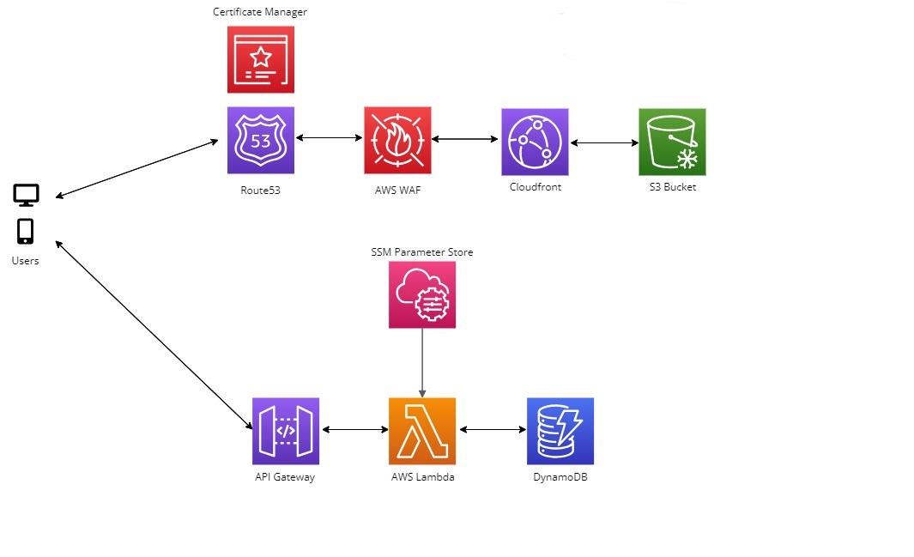

>:construction: **STATUS: This project is currently under development.** :construction:
# AWS Serverless Password Generator

This project is a simple web application for generating secure passwords, designed to demonstrate a complete web app development process including front-end, back-end, architecture, and deployment pipeline. It leverages a serverless architecture on AWS and includes features like password generation and storage.

Access the live project [here](https://pass.vaisnavsingkautick.com)

## Features

- Generate random, secure passwords.
- Store generated passwords securely in DynamoDB.
- Interface to retrieve and manage stored passwords.

## Technologies Used
- Frontend: React.js, hosted on AWS S3 and served using AWS CloudFront.
- Backend: AWS Lambda, AWS DynamoDB.
- Infrastructure: AWS API Gateway, Route53, WAF, SSM Parameter Store, Certificate Manager.
- CI/CD: GitHub Actions.
- Infrastructure As Code (IAC): Terraform.

## Architecture Diagram

## Usage
As this is a web application hosted on AWS, there is no installation necessary for the end user. Developers looking to run a local version of the app will need to install Node.js and React.js, and configure AWS CLI with the appropriate permissions.

## Deployment
This project uses GitHub Actions for Continuous Integration/Continuous Deployment (CI/CD) and Terraform for Infrastructure as Code (IaC). New changes can be deployed by creating a new Pull request to the main branch, and commenting "Deploy" in the comment section of the PR
## Getting Started

For detailed instructions and additional configuration options, please refer to the [documentation](docs/).

## Contributing

We welcome contributions to the Team Communication Web Tool project. To contribute, please follow these guidelines:

1. Fork the repository and create your branch: `git checkout -b my-branch`
2. Commit your changes: `git commit -am 'Add new feature'`
3. Push to the branch: `git push origin my-branch`
4. Submit a pull request

Please ensure that your code adheres to the project's coding standards and includes appropriate tests.

## Contact

For any questions or inquiries, please reach out at kautickv29@gmail.com

## Current Issues

1. Every time the Terraform script is applied, a new layer is created irrespective of whether changes have been made to the layer. This can consume a lot of storage and cost money..

